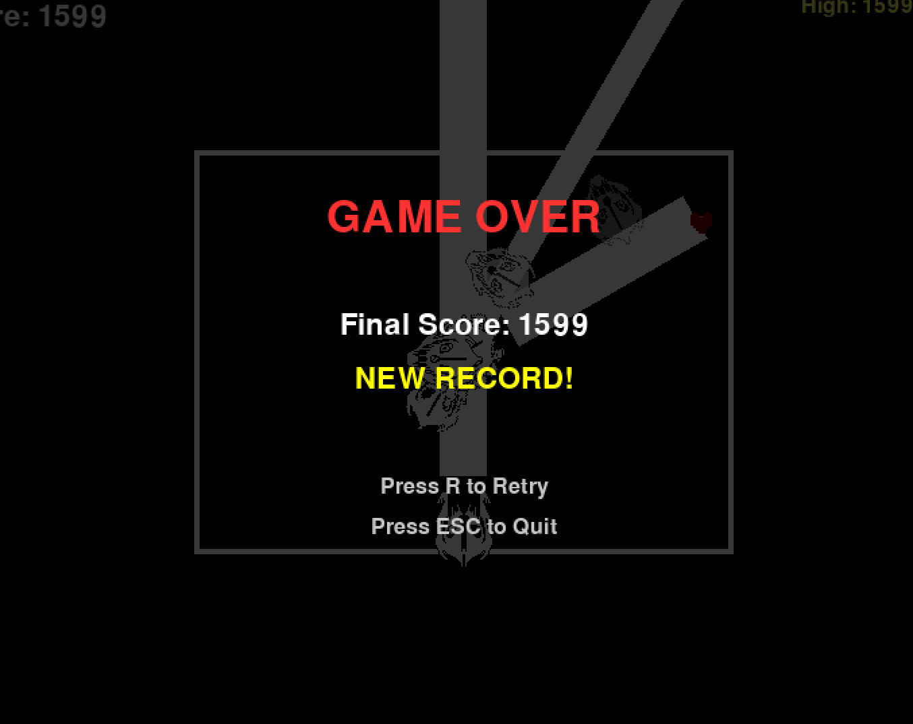
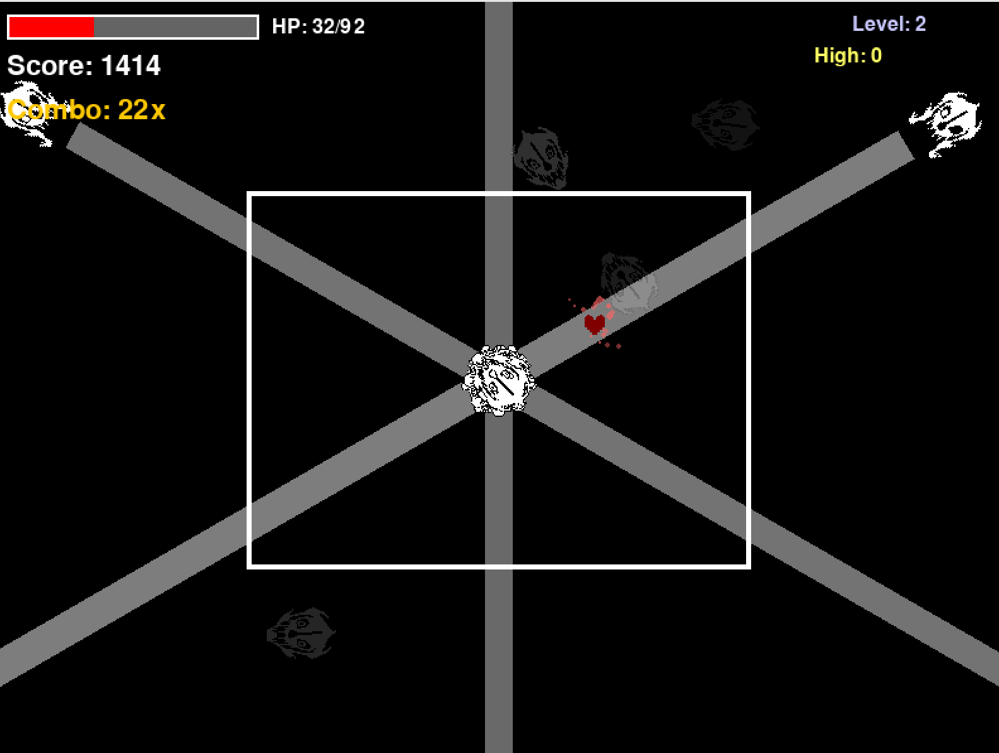
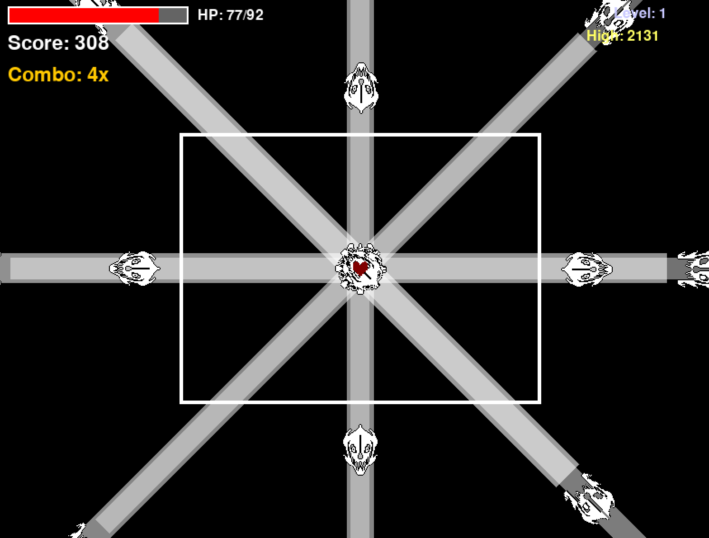

このゲームは，Undertale（RPGゲーム）に出てくるサンズ戦風のバトルシステムを再現することを目的としたものです。現在は、ソウル（自機）の移動、バトルボックス（自機が移動できる範囲）、ガスターブラスター（ビーム攻撃）のアニメーション、ビーム描画、複数の攻撃パターン、当たり判定、HPシステムなどが実装されています。
矢印キーで操作し，ビームをよけ，ハイスコアを目指してください．hpが０になるとゲームオーバーです．

ガスターブラスターは出現 → 開口 → 発射 → 後退という一連の動作をアニメーション付きで行います．ビームは，初期段階では斜めに発射する際に，細くなってしまうという問題が発生しました．そこで，回転矩形（ポリゴン）を使って描画される仕組みを利用しました。これにより、どの角度でも太さが一定で、逆方向に伸びたりズレたりする問題を解消しています。当たり判定はビームの幅を考慮した形で計算され、ソウルが触れた瞬間にダメージが入る仕組みにしました。また，ビームが発射中に太くなったり細くなったりする演出，ダメージを受けたときにエフェクトがつく演出などを追加しました．

ソウルには最大HP・現在HP・無敵時間が実装されており、ダメージ後は一定時間無敵になります。HPバーは画面左上に表示され、残量に応じてHPバーが縮む本家風のデザインです。
今後はサンズのメインとなる攻撃である「骨攻撃」などの追加をしていきたいです．
 

